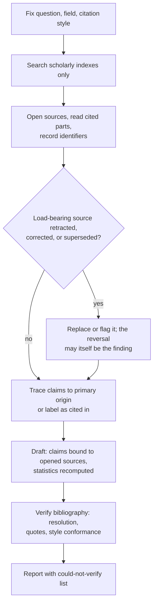

# Domain adapter: academic research

Applies when the deliverable must survive scholarly scrutiny: literature reviews, related-work sections, thesis or paper drafts, citation-backed arguments, methodology critiques. The loop is unchanged; these definitions replace the coding defaults. Nearest adapter is research and reporting: that one answers questions about the world from official pages and live products; this one takes over when claims must trace to the scholarly record and the bibliography is part of the deliverable. Medical and clinical work stays excluded per the template rule: a paper about it can be cited, a treatment claim cannot be made.

**Citation-bearing work is never trivial.** The triviality gate does not apply here, whatever the file count or line count. A copyedit that leaves a citation unchecked has verified nothing, and "just polish this" is the most common way an unsound draft reaches submission: the request sounds cosmetic precisely when the claims underneath it have never been examined. Any task touching a claim, a quotation, a statistic, or a reference runs the full loop, and the minimum evidence set below is binding even when the requested change looks like prose alone. Orienting first (listing the directory before editing) is part of that: a project's reading library, notices file, or bibliography usually sits beside the draft, and it cannot be consulted if it is never discovered.

## Workflow (steps + flowchart)

1. Fix the research question and the venue conventions (citation style such as APA, Chicago, or IEEE, plus the field's norms) before opening any source.
2. Search scholarly indexes (Crossref, Google Scholar, PubMed, arXiv, SSRN, the field's own databases), not the open web; blogs and news are leads at best, never sources.
3. Open each candidate source and read the cited part; record its identifier (DOI, PMID, arXiv ID), exact bibliographic data, and where in the text the claim lives.
4. Check the status of every load-bearing source: retractions, corrections, expressions of concern, and whether a preprint has a published version that supersedes it.
5. Separate what a source found from what it merely cites; chase load-bearing claims to their primary origin or label them "as cited in".
6. Draft with each claim bound to an opened source; recompute reported statistics where the inputs allow; keep a running could-not-verify list.
7. Verify the bibliography as its own artifact: every reference resolves to the claimed paper, every quote matches the text at its cited location, the style conforms to the named convention.

## Minimum evidence set (binding, before any claim is drafted)

1. **The research question and the venue's conventions**: the actual question plus the citation style and norms of the target field or venue; when none is stated, ask, or name the assumption in the report.
2. **The primary literature itself**: the papers, opened and read in the cited part. An abstract is a lead; a paper recalled from training is a hypothesis, never a citation.
3. **A live status check on every load-bearing source**: identifier resolution plus a retraction and correction lookup, fetched during this task, never recalled.

## Evidence and primary sources

Peer-reviewed articles > preprints and conference papers > working papers > memory; blogs, news, and aggregators are not evidence in this domain, only pointers toward something citable. A paper counts as evidence only after you opened it and read the cited part; citing from an abstract, or from another paper's summary of it, is secondhand and must be labeled as such.

## Authority order

The user's research question and stated conventions > the peer-reviewed literature > preprints and conference papers > working papers > your training memory. The classic conflict: training memory "knows" a famous finding that the live record has since retracted or failed to replicate; the live record wins, and the reversal is itself a finding worth reporting.

## Verification by observation

- Every citation resolves: the DOI, PMID, or arXiv ID is fetched and the landing page matches the claimed authors, year, title, and venue; a reconstructed reference is a fabricated one.
- Every quotation is verbatim against the actual text with its page or section; a paraphrase is labeled as one, outside quotation marks.
- Every load-bearing source carries a dated retraction and correction check; preprints additionally get the published-version check.
- Reported statistics are recomputed where the inputs allow, and claims of significance, effect size, or sample match what the cited paper actually tested.
- Attribution is explicit: "X found" only when you read X; "as cited in Y" when you did not.

## Fraud table (for fable-judge)

| Fraud | Symptom |
|---|---|
| Fabricated citations | references that do not resolve, or resolve to a different paper |
| Citation laundering | a claim attributed to a primary source but actually lifted from a review or another paper's citation |
| Zombie sources | retracted or corrected work cited as a live finding, with no flag |
| Quote drift | quotation marks around reworded text; cited pages that do not contain the quote |
| Overclaimed statistics | significance, effect sizes, or samples the cited paper does not support |
| Stale consensus | overturned or failed-replication findings stated as the current state of the field |
| Venue laundering | predatory or unreviewed venues cited with peer-reviewed authority |

## Done, by example

"The literature review is done" means: every reference resolved and read in the cited part, quotes verified at their locations, retraction checks dated, statistics recomputed or flagged, secondhand citations labeled, style conformant, and a could-not-verify list included. Not: "the literature broadly supports this."

## Sources

- Retraction Watch Database (retraction and correction lookup): https://retractiondatabase.org/ , accessed 2026-07-18
- Crossref REST API (DOI and metadata resolution): https://api.crossref.org/ , accessed 2026-07-18
- DOI Foundation resolver (identifier resolution): https://doi.org/ , accessed 2026-07-18
- Think. Check. Submit. (predatory venue checklist): https://thinkchecksubmit.org/ , accessed 2026-07-18
