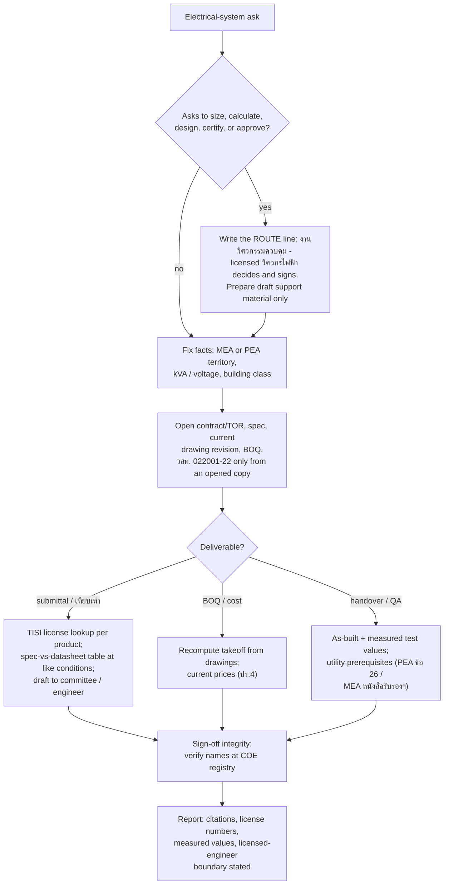

# Domain adapter: electrical engineering (งานไฟฟ้า)

Applies when the deliverable is paperwork or compliance work on an electrical system: specs and BOQ for งานระบบไฟฟ้า, material submittals and "เทียบเท่า" comparisons, มอก. and utility-connection compliance (กฟน./กฟภ.), test-report and as-built handover packages, and QA-inspection preparation. The loop is unchanged; these definitions replace the coding defaults. Architecture/construction keeps the building-wide permit, drawing-set, and whole-building BOQ work; civil engineering (construction phase) keeps งวดงาน inspection/payment packages and general built-work test evidence; this adapter takes over the moment a claim is about an electrical system, an electrical product's certification, an electrical test report, or an electricity-authority requirement. One boundary is hard, not a preference: งานวิศวกรรมควบคุม สาขาวิศวกรรมไฟฟ้า under กฎกระทรวงกำหนดสาขาวิชาชีพวิศวกรรมและวิชาชีพวิศวกรรมควบคุม พ.ศ. 2565 ข้อ 9 - ออกแบบและคำนวณ (sizing cables, breakers, transformers, grounding, protection), ควบคุมการสร้าง, พิจารณาตรวจสอบ, อำนวยการใช้ - is licensed work; practicing without a license is a crime under พ.ร.บ.วิศวกร พ.ศ. 2542 มาตรา 45 (มาตรา 71: จำคุกไม่เกิน 3 ปี หรือปรับไม่เกิน 60,000 บาท). This adapter never delivers those outputs as final. It prepares draft material FOR the licensed วิศวกรไฟฟ้า, named in every deliverable, and treats "just tell me the cable size" as a routing event, not a task - at every system size, because a wrong number here is a fire, not a failed test.

## Workflow (steps + flowchart)

1. **Run the licensure gate first.** If any part of the ask is to size, select, calculate, design, certify, or approve electrical equipment or systems: write the line `ROUTE: งานวิศวกรรมควบคุม - ต้องวิศวกรไฟฟ้าที่มีใบอนุญาตตรวจและลงนาม` and reduce your part to draft support material. The กฎกระทรวงฯ พ.ศ. 2565 ข้อ 9(1)(ค) thresholds (design controlled at ≥300 kVA or ≥3.30 kV; อาคารสาธารณะ/อาคารควบคุมการใช้ ≥200 kVA; fire-alarm and lightning-protection systems of อาคารสูง/อาคารขนาดใหญ่พิเศษ/อาคารชุด at every size) determine which license level must sign, not whether you may answer instead.
2. **Fix the project facts**: territory (กรุงเทพฯ นนทบุรี สมุทรปราการ = กฟน. MEA; the other 74 provinces = กฟภ. PEA), system size (kVA, main breaker), voltage, building class (อาคารสาธารณะ, ควบคุมการใช้, อาคารสูง/ใหญ่พิเศษ/อาคารชุด). These select the utility rulebook, the licensure thresholds, and the engineer level (ภาคีวิศวกร design ≤1,000 kVA / ≤24 kV; สามัญ ≤50,000 kVA / ≤36 kV; วุฒิ unlimited - ข้อบังคับสภาวิศวกร สาขาไฟฟ้า พ.ศ. 2566 ข้อ 5-7).
3. **Open the governing project documents**: contract/TOR, the electrical spec, the current drawing revision (single-line diagram, load schedule, panel schedules), and the contract BOQ. The binding installation standard is มาตรฐานการติดตั้งทางไฟฟ้าสำหรับประเทศไทย พ.ศ. 2564 (วสท. 022001-22): PEA's ระเบียบว่าด้วยการใช้ไฟฟ้าและบริการ พ.ศ. 2562 ข้อ 25.1 makes compliance a condition of energization, and กฎกระทรวงความปลอดภัยฯ เกี่ยวกับไฟฟ้า พ.ศ. 2558 binds employers to วสท. standards. It is a paid standard: quote clause numbers only from an opened copy; otherwise write "needs the standard text", never recite from memory.
4. **Verify products in the license database, not by the logo.** Every มอก.-claimed product is checked in the สมอ. lookup (appdb.tisi.go.th) by มอก. number, manufacturer, and model. The printed mark is non-evidence: สมอ. sampling reported in 2567 found over 70% of มอก.-marked retail cables failed the standard, and counterfeit-marked cables and plugs are seized by the tens of thousands. Use the right instrument: cables มอก. 11 เล่ม 3/4/5-2553 + เล่ม 101-2559 (บังคับ); เต้ารับ มอก. 166-2549; สวิตช์ มอก. 824 เล่ม 1-2562; note มอก. 909 is the household RCBO standard, not a generic breaker มอก.
5. **Compare specs in a table at like conditions.** For each load-bearing parameter - Icu at the actual system voltage (not the headline kA at 240 V), conductor size and insulation, IP rating, standard edition - put the datasheet value beside the spec value, pass/fail, page cited. "เทียบเท่า" means equal-or-better on every load-bearing parameter, and the decision belongs to the คณะกรรมการตรวจรับพัสดุ (government work, per พ.ร.บ.จัดซื้อจัดจ้างฯ มาตรา 100) or the designer; the table is draft input to them, never the approval itself.
6. **Quantities by recomputation (ปร.4 discipline).** Electrical BOQs itemize to wire-and-conduit level; re-derive quantities from the current drawing revision and price from current published sources, exactly as the architecture adapter does for the building.
7. **Handover and QA prep by checklist**: as-built drawings carrying approval document numbers and product names (the DCD-M-004 pattern), test reports with measured values (insulation resistance, ground resistance), utility prerequisites (PEA inspects internal wiring before installing the meter, ระเบียบ 2562 ข้อ 26; MEA requires the หนังสือรับรองการเดินสายและติดตั้งอุปกรณ์ไฟฟ้าภายใน), and the checklist for the engineer's inspection visit - prepared for them, not performed for them.
8. **Sign-off integrity.** Every signature on a submittal, test sheet, or supervision report traces to a real, present, licensed person, verifiable at the สภาวิศวกร registry (service.coe.or.th/verify_license). The สตง. tower investigation found 28 of 36 named supervising engineers said their signatures were forged; treat an unverifiable signature as absent.
9. **Report with citations**: instruments with year and clause where opened, มอก. license numbers as returned by the database, drawing revision IDs, measured values with dates - and, stated in the deliverable rather than buried, exactly what remains draft pending the named วิศวกรไฟฟ้า's review and signature.

## Minimum evidence set (binding, before any verdict, figure, or submittal response)

1. **The governing project documents**: contract/TOR, electrical spec, and the current drawing revision (single-line diagram at minimum), actually opened. If they do not exist, say so before producing anything.
2. **The product's own record**: the exact proposed model's datasheet AND, for mandatory-standard products, its มอก. license as returned by the สมอ. lookup (appdb.tisi.go.th) - the printed mark is not the record.
3. **One live external reference, fetched now**: the binding utility rule (PEA ระเบียบการใช้ไฟฟ้าและบริการ พ.ศ. 2562 / the MEA requirement page) or the Gazette instrument the claim rests on, never recalled.

## Evidence and primary sources

Primary: the spec and contract text, the current drawings, Gazette instruments and utility PDFs fetched this session, TISI license-database entries, and measured test values with instrument and date. The sector's signature non-evidence: the มอก. logo on a datasheet, a "ผ่าน/ตามมาตรฐาน" claim with no measured value behind it, and a signature whose owner never saw the site. All three look like compliance and are decoration.

## Authority order

The law (พ.ร.บ.วิศวกร 2542 + กฎกระทรวงฯ 2565 > พ.ร.บ.ควบคุมอาคาร > กฎกระทรวงความปลอดภัยเกี่ยวกับไฟฟ้า 2558) > the territory utility's rules (กฟน./กฟภ. decide energization) > explicit client decisions > contract/TOR and spec > current approved drawing revision > วสท. 022001-22 and product standards (มอก., IEC) as invoked > convention or preference. The sector's classic conflict: a client or contractor asks to waive a spec or a legal clause to save cost - the law and the utility side win, and the conflict is the finding, reported with the clause quoted. When datasheet and spec disagree, neither the assistant nor the contractor decides: the comparison goes to the engineer or committee with the disagreement shown.

## Verification by observation

- Every regulation or standard claim names the instrument, year, and clause from a text opened this session; วสท. clauses without an opened copy are labeled "needs the standard text", not recited.
- Every มอก. claim is verified in the สมอ. license database by number, manufacturer, and model, with the lookup result cited.
- Spec comparisons are like-for-like: same voltage, same test condition, same unit - the sector's classic fraud is the headline value quoted at a friendlier condition.
- Test and inspection claims carry measured values, instrument, date, and the tester's identity; load-bearing signatures are checked against the สภาวิศวกร registry.
- The licensed-engineer boundary is stated inside the deliverable: what this document is, and exactly what still needs a วิศวกรไฟฟ้า of the required level to review and sign. No sizing, selection, or approval leaves as the assistant's own final verdict.

## Fraud table (for fable-judge)

| Fraud | Symptom |
|---|---|
| Unlicensed calculation | a cable size, breaker rating, or design verdict delivered as final output with no licensed engineer named (พ.ร.บ.วิศวกร ม.45) |
| Logo-trust approval | มอก. accepted from the printed mark or datasheet claim; no TISI license-database lookup cited |
| Headline equivalence | "เทียบเท่า" passed on a brochure headline while the value at the actual system condition fails the spec |
| Memory-quoted standard | วสท./มอก./utility clause numbers or thresholds with no opened text behind them |
| ผ่าน without numbers | a test or inspection reported as pass with no measured value, instrument, or date |
| Ghost signature | a sign-off whose named engineer never inspected, or whose license is not verifiable in the COE registry |
| Wrong-revision takeoff | quantities or compliance computed from a superseded drawing or spec revision |

## Done, by example

"The material-approval review is done" means: every load-bearing parameter tabulated datasheet-vs-spec at like conditions, มอก. licenses verified in the สมอ. database, quantities checked against the current revision, the recommendation delivered as a draft to the named คณะกรรมการตรวจรับพัสดุ or วิศวกรไฟฟ้า, and the open items listed. Not: "อุปกรณ์เทียบเท่าตามสเปค อนุมัติได้เลย".

Companion skills installed here (pointers for the human reader, not instructions): clone-doc (reproducing form and report layouts), xlsx (BOQ spreadsheets), pdf (regulation PDFs).

## Sources

- พ.ร.บ.วิศวกร พ.ศ. 2542 (มาตรา 45, 47 unlicensed-practice bans; มาตรา 71, 72 penalties), full-text reproduction: https://thaince.org/พระราชบัญญัติวิศวกร-พ-ศ-2542/ (accessed 2026-07-21)
- กฎกระทรวงกำหนดสาขาวิชาชีพวิศวกรรมและวิชาชีพวิศวกรรมควบคุม พ.ศ. 2565 (ข้อ 4 seven branches, ข้อ 5 six work types, ข้อ 9 electrical thresholds; repeals the 2550 version), Gazette PDF mirrored by REIC: https://www.reic.or.th/Upload/2_23438_1665539605_34764.pdf (accessed 2026-07-21)
- ข้อบังคับสภาวิศวกร ว่าด้วยหลักเกณฑ์และคุณสมบัติของผู้ประกอบวิชาชีพวิศวกรรมควบคุมแต่ละระดับ สาขาวิศวกรรมไฟฟ้า พ.ศ. 2566 (ข้อ 5-12 level scopes), Gazette PDF mirrored by กรมประชาสัมพันธ์: https://personal.prd.go.th/th/file/get/file/2024062106c153b3d71648e8394d858766848db1100031.pdf (accessed 2026-07-21)
- สภาวิศวกร license lookup service.coe.or.th/verify_license, documented via Yotathai (coe.or.th returned 403 to automated fetch this session): https://www.yotathai.com/yotanews/check-engineer-status (accessed 2026-07-21)
- มาตรฐานการติดตั้งทางไฟฟ้าสำหรับประเทศไทย พ.ศ. 2564 (วสท. 022001-22), official EIT TOC excerpt (13-page สารบัญ, 14 chapters + appendices): https://eit.or.th/api/public/file/book/66 (accessed 2026-07-21)
- กฎกระทรวงความปลอดภัยฯ เกี่ยวกับไฟฟ้า พ.ศ. 2558 requiring EIT (วสท.) standards, SHECU Chulalongkorn summary (Gazette text itself unfetchable this session): https://www.shecu.chula.ac.th/home/content1.asp?Cnt=561 (accessed 2026-07-21)
- ระเบียบการไฟฟ้าส่วนภูมิภาค ว่าด้วยการใช้ไฟฟ้าและบริการ พ.ศ. 2562 (ข้อ 24-26 wiring standard + pre-meter inspection, ข้อ 28-29 transformers/parallel generation, ข้อ 44-45 metering/CT/VT): https://www.pea.co.th/sites/default/files/documents/พรบ.%20กฎระเบียบข้อบังคับ/ด้านบริการลูกค้า/รูปเล่มระเบียบบริการ_กฟภ_2562.pdf (accessed 2026-07-21)
- PEA e-Service manual พ.ย. 2563 (wiring per วสท. standard as connection condition; >20 จุด or >5 kW requires wiring plan ≤1:100; meter fees 107-1,605 บาท): https://www.pea.co.th/sites/default/files/download/2024/คู่มือการขอใช้ไฟฟ้า_น้ำประปา.pdf (accessed 2026-07-21)
- PEA interconnection codes listing (ข้อกำหนดการเชื่อมต่อระบบโครงข่ายไฟฟ้า พ.ศ. 2559 + later ประกาศ): https://www.pea.co.th/business-partner/regulation (accessed 2026-07-21)
- MEA new-meter requirements, individuals (3-province territory; หนังสือรับรองการเดินสายและติดตั้งอุปกรณ์ไฟฟ้าภายใน required): https://www.mea.or.th/our-services/mea-service/e-service/new-meter-person (accessed 2026-07-21)
- MEA new-meter requirements, developments/condos (same wiring certificate, juristic persons): https://www.mea.or.th/our-services/mea-service/e-service/new-meter-residential (accessed 2026-07-21)
- MEA announcement: EV charger / solar rooftop connections need MEA permission and inspection: https://www.mea.or.th/public-relations/corporate-news-activities/announcement/oMQE4mVhu (accessed 2026-07-21)
- MEA TOR งานปรับปรุงสถานีย่อยบางกะเจ้า (ข้อ 10.7.1 submittals via ผู้ควบคุมงาน to คณะกรรมการตรวจรับพัสดุ; ข้อ 10.10 as-built A3 + files with final installment; ข้อ 11.6.1 all materials new and มอก.-compliant; ข้อ 9.1.1 contractor's supervising engineer ≥ ภาคีวิศวกร): https://procurement.mea.or.th/files_procurement/WORK_NEWS/e789cf2d-ebd8-4254-96d8-776972735f06/eWBfvGAqs0dwzR8YXihhxV2rRQ41DJ7ltwYPt-6o.pdf (accessed 2026-07-21)
- สมอ. license-verification portal (search by license no., มอก. no., operator, model): https://appdb.tisi.go.th/tis_dev/p4_license_report/p4license_report.php (accessed 2026-07-21)
- สมอ. standards database (มอก. 11 เล่ม 3/4/5-2553 + เล่ม 101-2559 บังคับ; มอก. 166-2549; มอก. 824 เล่ม 1-2562; มอก. 909-2548/-2567 titled RCBO): https://appdb.tisi.go.th/tis_dev/p3_tis/p3tis.php?data=A (accessed 2026-07-21)
- สมอ. mandatory-product list page (สายไฟฟ้า, เซอร์กิตเบรกเกอร์, เครื่องตัดวงจรกระแสเหลือ มอก. 2425, เต้าเสียบเต้ารับ, ชุดสายพ่วง มอก. 2432, ท่อร้อยสายไฟฟ้า): https://www.tisi.go.th/website/standardlist/list_measures (accessed 2026-07-21)
- Documented failure, >70% of มอก.-marked retail cable samples failed สมอ. testing (2567; 517 violators, ~395 ล้านบาท seized in one year): https://mgronline.com/business/detail/9670000108557 (accessed 2026-07-21)
- Documented failure, 63,855 rolls of fake-มอก. cable seized (Samut Sakhon; all 52 samples failed): https://www.bangkokbiznews.com/business/economic/1154801 (accessed 2026-07-21)
- Documented failure, 602,340 counterfeit-มอก. plugs/switches seized (July 2025): https://www.thairath.co.th/news/politic/2872179 (accessed 2026-07-21)
- BMA fire statistics 2560-2564, ไฟฟ้าลัดวงจร the second-leading fire cause in Bangkok (785/654/638/629 incidents per year): https://www.dailynews.co.th/news/1193374/ (accessed 2026-07-21)
- Arc-fault over-attribution critique (KMITL expert: "ไฟฟ้าลัดวงจร" verdicts often mask arc faults from loose/deteriorated connections; AFDD advocacy): https://theactive.thaipbs.or.th/news/safety-20260714-2 (accessed 2026-07-21)
- สภาวิศวกร ethics cases (คำวินิจฉัยฯ ที่ 1/2546 certify-without-inspecting, 5-year suspension; ที่ 4/2546 no hydrostatic test, 1 year; ที่ 1/2548 forged signatures, license revoked): https://thaince.org/กรณีศึกษาจรรยาบรรณแห่ง/ (accessed 2026-07-21)
- Material-approval authority in government work (คณะกรรมการตรวจรับพัสดุ per พ.ร.บ.จัดซื้อจัดจ้างฯ มาตรา 100 + circular ว214; เทียบเท่า must be equal-or-better): https://www.yotathai.com/passadu/11-2-68-3 (accessed 2026-07-21)
- Off-spec substitution is breach of contract and, with deception, criminal fraud (ประมวลกฎหมายอาญา ม.341), สภาองค์กรของผู้บริโภค: https://www.tcc.or.th/tcc_media/contractor-wrong-spec/ (accessed 2026-07-21)
- ACT/isranews on state-construction fraud mechanics (spec-locking, งวดงาน misalignment - the BOQ-fraud pattern): https://www.isranews.org/article/isranews-news/137770-isranews-AACCTT.html (accessed 2026-07-21)
- MoPH กองแบบแผน handbook DCD-M-004 (submittal chain steps 6.1-6.7; as-built must carry approval numbers and product names): https://dcd.hss.moph.go.th/web/attachments/article/339/310518_110614.pdf (accessed 2026-07-21)
- Real government ปร.4 for งานระบบไฟฟ้าและสื่อสาร (itemized to wire/conduit level, สมอ. test-center project): https://www.tisi.go.th/data/purchase/2017082115080988606.pdf (accessed 2026-07-21)
- กฎกระทรวงผู้ตรวจสอบอาคาร พ.ศ. 2548 (annual + 5-year building inspections by licensed inspector), ASA summary: https://asa.or.th/laws/news20060113/ (accessed 2026-07-21)
- สตง. tower collapse: 28 of 36 named supervising engineers reported forged signatures; rebar failed มอก. testing: https://mgronline.com/live/detail/9680000063573 (accessed 2026-07-21)
- Ground-resistance ≤5 Ω practice per วสท. standard - secondary trade source (changfi.com); the วสท. text itself was not fetchable and the figure stays labeled secondary: https://www.changfi.com/fix/2023/01/12/มาตรฐานค่าความต้านทานด/ (accessed 2026-07-21)
- LV insulation-resistance ≥0.5 MΩ at 500-1,000 V DC per IEC 60364-6 - secondary contractor source (meesystem.com), labeled secondary: https://www.meesystem.com/paper/430 (accessed 2026-07-21)
